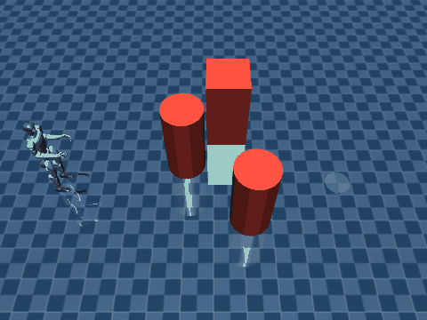
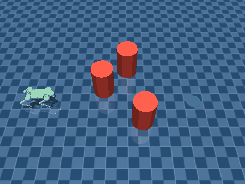

# MuJoCo Obstacle Navigation (geometric, NVIDIA-free, Mac-native)

Reactive "see an obstacle → steer around it → reach the goal" for legged robots in sim, with no
GPU and no learned perception. Verified on Apple Silicon: the pretrained **G1 walk navigates a
field of obstacles to a goal, upright** (`g1_nav_demo.py` → `NAVIGATED TO GOAL ✓`).

## Architecture — three decoupled modules
1. **SENSE (geometric, CPU).** A fan of `mujoco.mj_ray` casts from the robot's pelvis. Obstacles
   live in a dedicated **geom group** and rays are masked to that group, so a ray never hits the
   robot itself (no self-hits, no parent-body issues). `-1` (no hit) maps to RMAX. Equivalent to
   a ring/fan of MuJoCo `<rangefinder>` sensors; both are exact engine raycasts, no rendering.
2. **PLAN (stateless `ranges → (vx, vy, wz)`).** A VFH gap-finder: build a binary polar histogram
   (sector blocked if range < SAFE), widen blocked sectors by the robot radius, pick the free
   sector nearest the goal heading, scale forward speed by clearance and yaw-rate by the steer
   angle. Pure NumPy. (VFH avoids the local-minima sticking of naive potential fields.)
3. **ACT (the only coupling).** The `(vx, vy, wz)` command drives a velocity-tracking gait. The
   demo passes the planner as the **callable command** of `mujoco-pretrained-deploy`'s
   `g1_walk.walk(m, d, policy, cmd, ...)`, which reads the live `MjData` each control step.

Because the only perception↔locomotion link is the velocity command, the identical sensor+planner
code can later ride a steerable GO2 trot or any other gait that tracks `(vx, vy, wz)`.

## Instructions
```bash
# G1 humanoid (pretrained walk) navigates obstacles to the goal
python scripts/g1_nav_demo.py --video assets/g1_nav.gif --secs 13
# GO2 quadruped (model-based steerable trot) — SAME planner, different gait
python scripts/go2_nav_demo.py --video assets/go2_nav.gif --secs 20
# a MOVING (mocap) obstacle + a boxed-in turn-to-find-a-gap recovery:
python scripts/go2_nav_dynamic.py --video assets/go2_nav_dynamic.gif --secs 26
```
The GO2 trot is made steerable by `mujoco-controller-baselines`' `go2_trot.trot(m, d, cmd, ...)`:
`vx` scales stride, `wz` turns via a left/right stride differential (signed to match the G1 walk
convention: `wz>0` = CCW), so one planner fits both robots.
Tune in `g1_nav_demo.py`: `OBSTACLES` (x, y, kind, size), `GOAL`, fan `N`/`FOV`/`RMAX`, and the
planner's `SAFE` clearance. Add obstacles by appending to `OBSTACLES` (they are injected into the
scene via `mujoco.MjSpec`; the robot model is untouched). Runtime-movable obstacles can use mocap
bodies. **Rendering note:** obstacle/goal geom groups must be enabled in the `MjvOption`
(`vopt.geomgroup[4]=vopt.geomgroup[5]=1`) or they are invisible (groups >2 are off by default).




## Scope & honesty
- ✅ Local on Mac, NVIDIA-free: geometric obstacle avoidance + goal-seeking on the G1 walk.
- ⚠️ Reactive (no global path planning / memory) — can be locally trapped in adversarial layouts;
  rangefinders mounted on the bobbing pelvis add mild scan noise.
- ❌ Out of scope: camera/depth-based perception, segmentation, SLAM, real-world sensing — those
  need GPU/learned perception and are deliberately excluded. This is exact geometric sensing of
  known sim geoms only.

## References
- `references/prototypes/` — the verified rangefinder + VFH prototypes (avoid_demo.py, rf_test*.py)
  this skill was built from.
