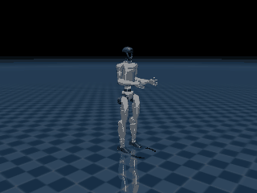

# MuJoCo Pretrained-Policy Deploy (humanoid walking, NVIDIA-free, Mac-native)

The reliable path to **humanoid walking on a Mac without NVIDIA or RL training**: replay an
already-trained locomotion policy locally on CPU. Verified on Apple Silicon (M5 Max): the
vendored Unitree **G1 walks forward at ~0.45 m/s** and tracks a velocity command.

## Why replay (not hand-built control)
Hand-built model-based biped walking needs a closed-loop CoM/ZMP regulator (open-loop foot-lift
tips the robot — verified) and is a multi-week research problem. A pretrained policy already
encodes that balance. Running it is pure CPU inference, so it fully satisfies the project's
100%-local / no-cloud / no-training constraint.

## Embodiment note (important)
This G1 WALK uses a **12-DOF, legs-only, TORQUE model** (`g1_12dof`, `<motor>` actuators + a
software PD). It is a **separate embodiment** from the 29-DOF **position**-actuator Menagerie
model used by `mujoco-controller-baselines` (`g1_stand.py`, `g1_squat.py`). Arms and waist are
**not actuated** while walking (held at default). Do not try to unify the two models.

## How it works (vendored from unitree_rl_gym, self-contained)
- `vendor/g1/motion.pt` — torch-JIT policy. `vendor/g1/model/scene.xml` (+ `g1_12dof.xml`,
  meshes) — the bonded model. `vendor/g1/g1.yaml` — original config. No `legged_gym` import
  and no GUI viewer (replaced by a local path constant + headless loop).
- Control loop (`scripts/g1_walk.py`): 500 Hz sim, **policy at 50 Hz** (decimation 10). Each
  policy step builds a **47-dim observation** = base angular velocity (×0.25), projected gravity,
  command (vx,vy,wz)×[2,2,0.25], (q−default)×1.0, qvel×0.05, previous action, [sin, cos] of an
  0.8 s phase clock. The 12 actions are target-angle deltas: `target = action×0.25 + default`.
  A software PD (`tau = (target−q)·kp + (−qd)·kd`, kp/kd from the config) drives the torque model.
- The policy is stateful — start each episode from a fresh load / reset; don't reset mid-episode.

## Instructions
```bash
# G1 walks forward (default cmd vx=0.5)
python scripts/g1_walk.py --secs 6 --vx 0.5            # -> RESULT: WALKS ✓ (~0.45 m/s)
# robustness: 2 min through a changing command schedule + fall detection
python scripts/g1_walk_stress.py --secs 120           # -> STAYED UPRIGHT ✓ (max tilt ~6 deg)
# steer with the velocity command (this is the obstacle-avoidance hook)
python scripts/g1_walk.py --secs 6 --vx 0.3 --wz 0.5   # turn while walking
python scripts/g1_walk.py --secs 6 --vy -0.3           # sidestep right
# render a GIF (offscreen, plain python3)
python scripts/render_g1_walk.py assets/g1_walk.gif --secs 6
```

## API for other skills
`g1_walk.py` exposes `make() -> (m, d, policy)` and `walk(m, d, policy, cmd, steps, log=None)`
where `cmd` is `[vx, vy, wz]` **or a callable(t) -> [vx,vy,wz]**. An obstacle-avoidance planner
(`mujoco-obstacle-navigation`) passes a callable that turns rangefinder readings into a velocity
command — that is the only coupling between perception and locomotion.



## Scope & honesty
- ✅ Local on Mac, NVIDIA-free: G1 forward walk + velocity-command steering (verified).
- ⚠️ 12-DOF legs-only (no arm/waist motion). Long-horizon (minutes) robustness not yet stressed.
- ❌ Out of scope: training/fine-tuning (cloud/GPU), whole-body 29-DOF gaits, running.

## License
Skill code: Apache-2.0. Vendored Unitree policy + model: BSD-3-Clause (Unitree), see
`vendor/g1/LICENSE-unitree_rl_gym`. Source: github.com/unitreerobotics/unitree_rl_gym.
