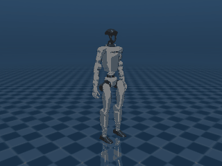

# MuJoCo-skills

**Robot-behavior Agent Skills for MuJoCo that run 100% locally on a Mac (Apple Silicon) — no NVIDIA GPU, no cloud.**

Modeled on the open [Agent Skills](https://agentskills.io) / [`skills` CLI](https://github.com/vercel-labs/skills) ecosystem (the same `SKILL.md` format used by NVIDIA/skills), so each skill installs into **Claude Code and Codex** with one command. The goal: bring legged-robot behaviors — walk, stand, sit, obstacle avoidance — for Unitree **GO2** (quadruped) and **G1** (humanoid) to every Mac user, even without any NVIDIA environment.

> **Status:** 6 working skills, all verified on an Apple **M5 Max** (CPU-only, NVIDIA-free). See the [strategy doc](mujoco-mac-skill-strategy.md) for the full plan, research, and benchmarks.

## Quickstart

```bash
# install all skills into Claude Code + Codex (verified: lands in ~/.claude/skills and ~/.agents/skills)
npx skills add <user>/MuJoCo-skills --skill '*' --agent claude-code --agent codex --copy

# then, in the repo, fetch robot models + verify the Mac (run this first):
pip install mujoco numpy torch pillow robot_descriptions
python .agents/skills/mujoco-env-setup/scripts/setup.py

# now run a behavior, e.g. GO2 trots forward:
python .agents/skills/mujoco-controller-baselines/scripts/go2_trot.py --secs 8
```

## The skills

| Skill | What it does |
|---|---|
| [`mujoco-env-setup`](.agents/skills/mujoco-env-setup/) | Prepare the Mac (no-NVIDIA check, deps), fetch GO2/G1 models into `models/`, smoke test, agent-visibility check. **Run first.** |
| [`mujoco-viewer`](.agents/skills/mujoco-viewer/) | Interactive 3D viewer — encodes the macOS `mjpython` rule (and the #798 viewer-vs-offscreen split). |
| [`mujoco-offscreen-render`](.agents/skills/mujoco-offscreen-render/) | Headless RGB / depth / segmentation via CGL (plain python3), for rollout videos & eval. |
| [`mujoco-controller-baselines`](.agents/skills/mujoco-controller-baselines/) | Model-based control: **GO2 stand + steerable trot**, **G1 stand / squat (sit-to-stand) / floor sit-down** (CEM-optimized). The behavior spine. |
| [`mujoco-pretrained-deploy`](.agents/skills/mujoco-pretrained-deploy/) | Replay a pretrained policy locally: **G1 humanoid walk** (vendored Unitree `motion.pt`, CPU), steered by a `(vx,vy,wz)` command. |
| [`mujoco-obstacle-navigation`](.agents/skills/mujoco-obstacle-navigation/) | Rangefinder + VFH planner → velocity command. **One planner navigates both the G1 walk and the GO2 trot** around obstacles to a goal. |

## Demos (all CPU-only, NVIDIA-free, on a Mac)

| GO2 trot (model-based) | G1 walk (pretrained replay) |
|---|---|
|  |  |
| **G1 floor sit-down (CEM)** | **G1 + GO2 obstacle navigation** |
|  |  |

## Principles

- **100% local on Apple Silicon. No NVIDIA, no cloud.** Things that genuinely need a datacenter GPU (from-scratch humanoid RL, photoreal data, running gaits) are out of scope by design.
- **Model-based control is the spine**; humanoid walking ships via **pretrained-policy replay**, not from-scratch RL.
- **Honest about hard cases.** Floor get-up and chair-sit are balance-critical *support-transfer* transitions that open-loop control can't do — documented, not faked (see `mujoco-controller-baselines/references/g1-sit-recipe.md`).
- **Sim-first.** Deploying to real Unitree hardware is a documented hand-off (Linux/DDS), not run from the Mac.

## Repo layout
- `mujoco-mac-skill-strategy.md` — strategy v2.2 (research, decisions, M5 Max benchmarks, verification logs).
- `.agents/skills/` — the 6 skills (agent-agnostic layout). `skills.sh.json` + `.codex-plugin/plugin.json` package them for discovery / Codex.
- `models/` — robot models, git-ignored, populated by `mujoco-env-setup` (keeps `npx skills add` fast).

## License
Apache-2.0 (skill code). The vendored Unitree G1 walk policy/model is BSD-3-Clause (Unitree). Robot models are from [MuJoCo Menagerie](https://github.com/google-deepmind/mujoco_menagerie) under their respective licenses.
