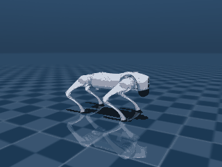

# MuJoCo-skills

**Robot-behavior Agent Skills for MuJoCo that run 100% locally on a Mac (Apple Silicon) — no NVIDIA GPU, no cloud, no RL required.**

Modeled on the open [Agent Skills](https://agentskills.io) / [`skills` CLI](https://github.com/vercel-labs/skills) ecosystem (the same `SKILL.md` format used by NVIDIA/skills), so each skill installs into Claude Code and Codex with one command. The goal: bring legged-robot behaviors (walk, sit/stand, obstacle avoidance) for Unitree **GO2 / G1 / H1** and others to every Mac user, even without any NVIDIA environment.

> **Status: early.** This repo currently contains the strategy and **one working skill** (`mujoco-controller-baselines`) that proves the core thesis end-to-end. The rest of the roadmap (foundation skills, humanoid pretrained-policy replay, navigation, packaging) is still ahead — see the strategy doc.

## What's here

| Path | What |
|---|---|
| [`mujoco-mac-skill-strategy.md`](mujoco-mac-skill-strategy.md) | Full strategy & verified research (v2.2). **Part II is the canonical plan.** Includes M5 Max benchmarks and Phase 1/2 verification logs. |
| [`.agents/skills/mujoco-controller-baselines/`](.agents/skills/mujoco-controller-baselines/) | The first skill: model-based stand & trot for legged robots. |

## The lighthouse demo — GO2 trots forward, NVIDIA-free

`mujoco-controller-baselines` makes a Unitree GO2 **stand and trot forward at ~0.23 m/s** using only model-based control (CPG foot trajectory → analytic 2-link leg IK → software PD on torque actuators). Verified on an Apple M5 Max, CPU-only, no GPU, no RL.



```bash
# needs: pip install mujoco numpy pillow  + a MuJoCo Menagerie unitree_go2 model
python .agents/skills/mujoco-controller-baselines/scripts/go2_stand.py  path/to/unitree_go2/scene.xml
python .agents/skills/mujoco-controller-baselines/scripts/go2_trot.py   path/to/unitree_go2/scene.xml --secs 8
```

See [`references/go2-trot-recipe.md`](.agents/skills/mujoco-controller-baselines/references/go2-trot-recipe.md) for the recipe, the IK derivation, and the gotchas (torque vs position actuators, the `forcerange=(0,0)` trap, duty/lift → forward vs backward).

## Install as a skill (planned distribution)

```bash
npx skills add <user>/MuJoCo-skills --skill '*' --agent claude-code --agent codex
```

## Principles

- **100% local on Apple Silicon. No NVIDIA, no cloud.** Anything that genuinely needs a datacenter GPU (from-scratch humanoid RL, running gaits) is out of scope by design.
- **Model-based control is the spine**; humanoid walking ships via pretrained-policy replay, not RL.
- **Sim-first.** Deploying to real Unitree hardware is a documented hand-off (Linux/DDS), not run from the Mac.

## License

Apache-2.0 (skill code). Robot models are from [MuJoCo Menagerie](https://github.com/google-deepmind/mujoco_menagerie) under their respective licenses.
